**Last updated 9th November 2023**

## Objective  

From your project's main page in the Console, you can see all your environments as a list or a project tree:

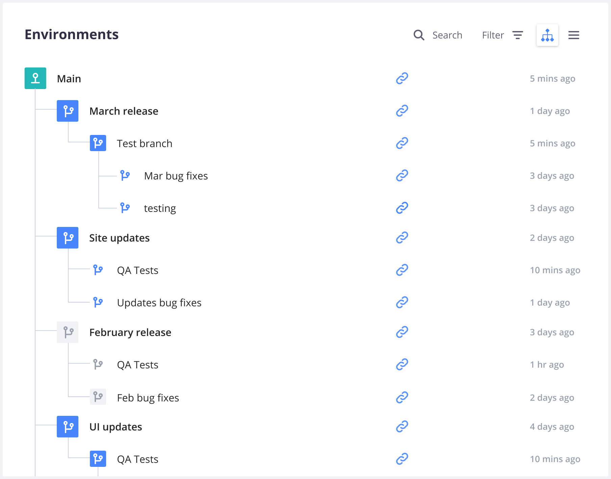

In this overview, the names of inactive environments are lighter.
Selecting an environment allows you to see details about it,
such as its [activity feed](#activity-feed), [services](#service-information),
[metrics](../../increase-observability/increase-observability-metrics), and [backups](../../environments/environments-backup).

## Activity Feed

When you access an environment in the Console, you can see its [activity feed](../../increase-observability/logs/access-logs.md#activity-logs).
This allows you to check which activities have happened or are currently happening on the selected environment:

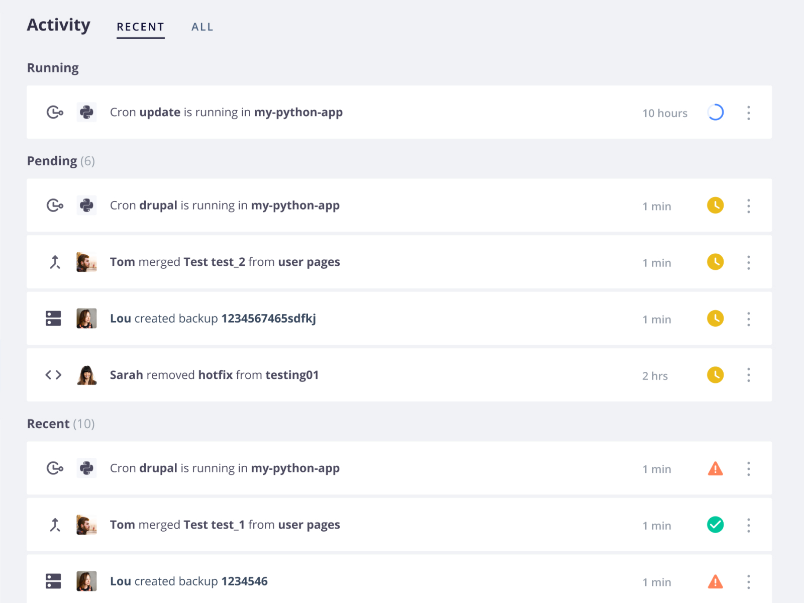

You can filter activities by type (such as merge, sync, or redeploy).

## Actions on environments

Each environment offers ways to keep environments up to date with one another:

* [ **Branch**](/glossary.md#branch) to create a new child environment.
* [ **Merge**](/glossary.md#merge) to copy the current environment into its parent.
* [ **Sync**](/glossary.md#sync)
  to copy changes from its parent environment into the current environment.

There are also additional options:

*  **Settings** to [configure the environment](#environment-settings).
*  **More** to get more options.
* **URLs** to access the deployed environment from the web.
* **SSH** to access your project using SSH.
* **Code**
  * **CLI** for the command to get your project set up locally with the [Web PaaS CLI](../administration/administration-cli).
  * **Git** for the command to clone the codebase via Git.
  
    If you're using Web PaaS as your primary remote repository, the command clones from the project.
    If you have set up an [external integration](../../integrations/integrations-source),
    the command clones directly from the integrated remote repository.

    If the project uses an external integration to a repository that you haven't been given access to,
    you can't clone until your access has been updated.
    See how to [troubleshoot source integrations](../../integrations/integrations-source/troubleshoot).

## Environment URL

When you access an environment in the Console, you can view its URL:

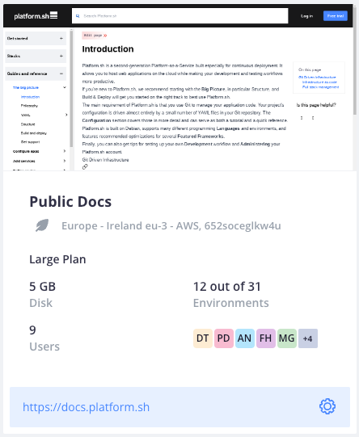

While the environment is loading in the Console, a `Waiting for URL...` message is displayed instead of the URL.
If this message isn't updated once your [default environment](../../environments/_index.md#default-environment)'s information is loaded,
follow these steps:

1\. Check that [you have defined routes](../../define-routes) for your default environment.

2\. Verify that your [application](../../create-apps/create-apps-app-reference), [services](../../add-services), and [routes](../../define-routes) configurations are correct.

3\. Check that your default environment is [active](../../environments/deactivate-environment.md#reactivate-an-environment).

## Environment settings

To access the settings of an environment, click  **Settings** within that environment.

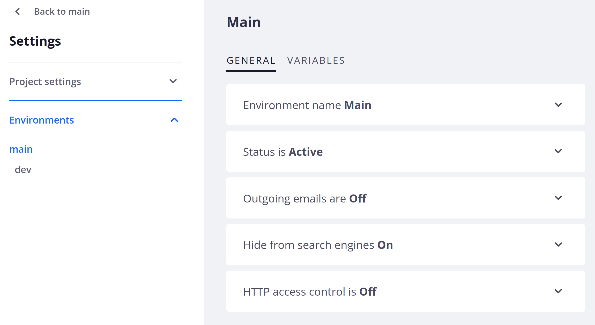

### Environment name

Under **Environment name**, you can edit the name and type of your environment and view its parent environment:

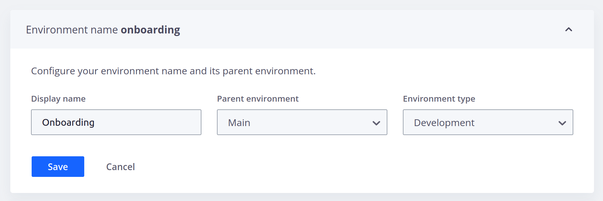

### Status

Under **Status**, you can check whether or not your environment is [active](/glossary.md#active-environment).

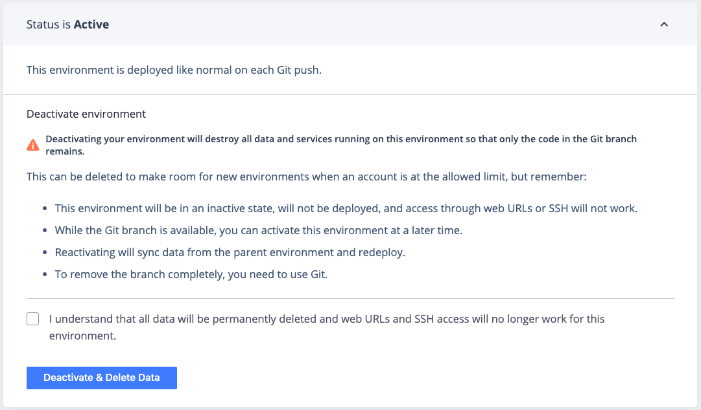

For preview environments, you can [change their status](../../environments/environments-deactivate-environment).

### Outgoing emails

Under **Outgoing emails**, you can allow your environment to [send emails](../../development/development-email):

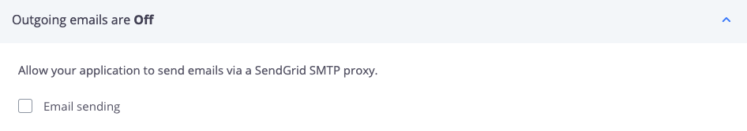

### Hide from search engines

Under **Hide from search engines**, you can tell [search engines to ignore the site](../../environments/environments-search-engine-visibility):

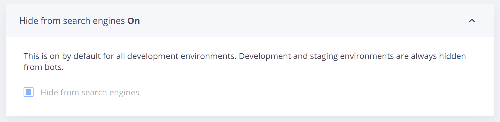

### HTTP access control

Under **HTTP access control**, you can [control access to your environment using HTTP methods](../../environments/environments-http-access-control):

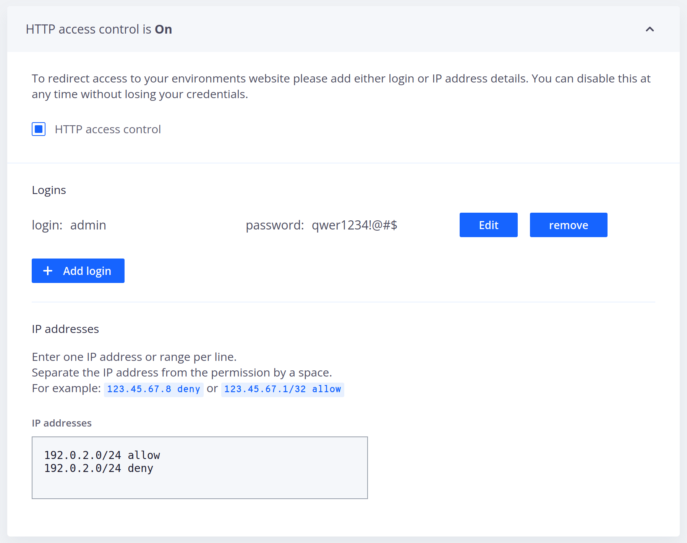

### Variables

Under **Variables**, you can define [environment variables](../../development/development-variables):

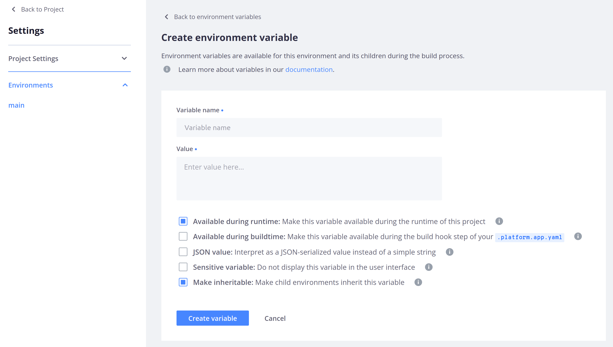

## Service information

For each environment, you can view information about how your routes, services, and apps are currently configured.

To do so, click **Services**.
By default, you see configured routes.

### Routes

The **Router** section shows a list of all the [routes configured on your environment](../../define-routes).
You can see each route's type and check if caching and server side includes have been enabled for it:

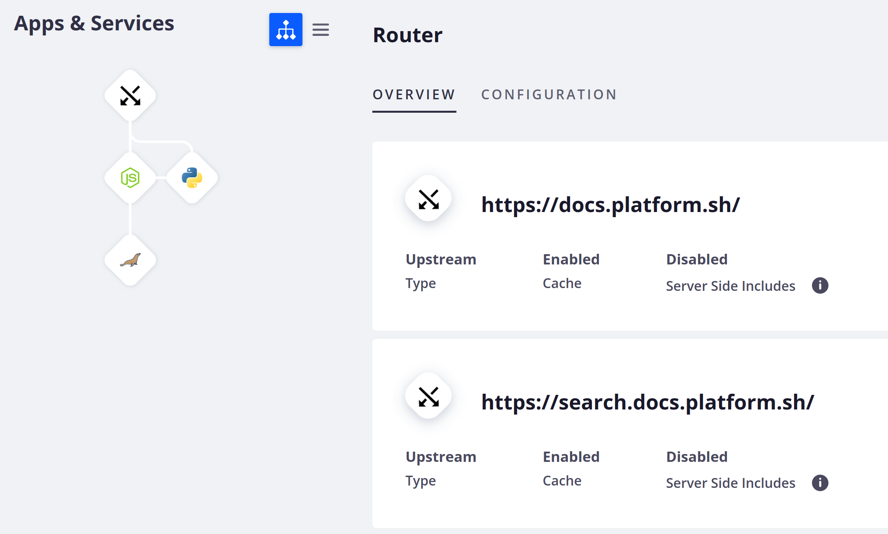

To view the configuration file where your routes are set up, click **Configuration**.

### Applications

To see detailed information about an app container,
select it in the tree or list on the left-hand side:

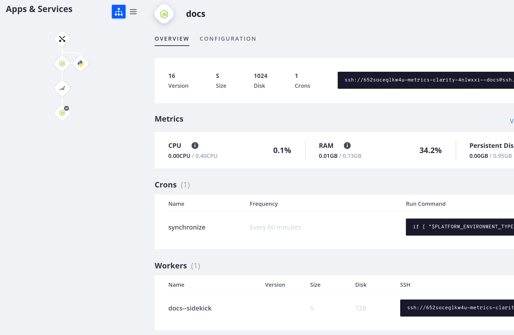

The **Overview** tab gives you information about your app.
You can see:

* The language version, the container size, the amount of persistent disk,
  the number of cron jobs, and the command to SSH into the container.
* A summary of [metrics for the environment](../../increase-observability/increase-observability-metrics).
* All cron jobs with their name, frequency, and command.
* All workers with their name, size, amount of persistent disk, and command to SSH into the container.

To view [the configuration file where your app is set up](../../create-apps/), click **Configuration**.

### Services

To see detailed information about a [running service](../../add-services),
select it in the tree or list on the left-hand side:

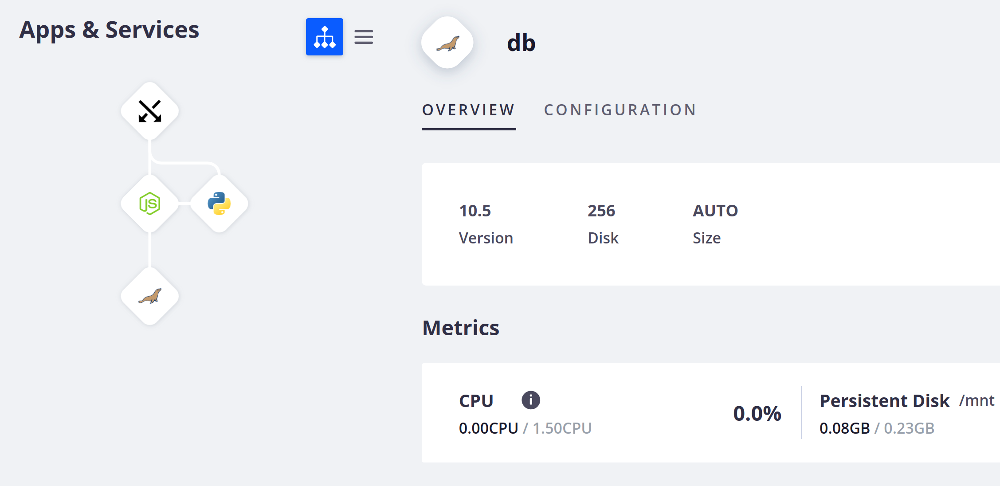

The **Overview** gives you information about the selected service.
You can see the service version, the container size, and the disk size, if you've configured a persistent disk.
You can also see a summary of [metrics for the environment](../../increase-observability/increase-observability-metrics).

To view the configuration file where your services are set up, click **Configuration**.
