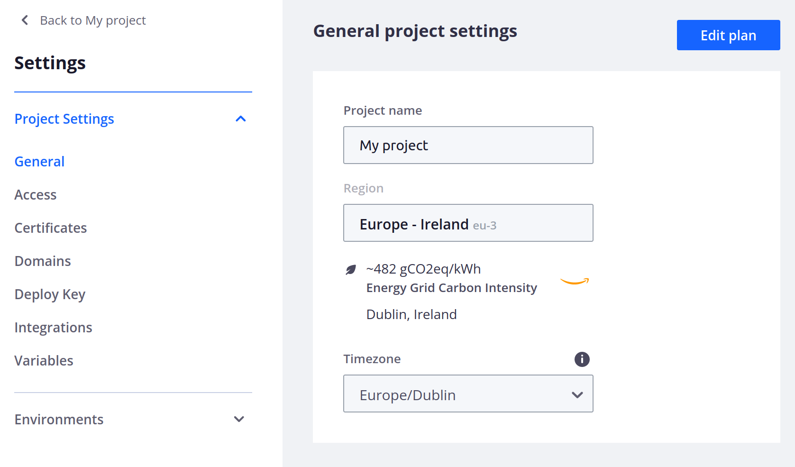
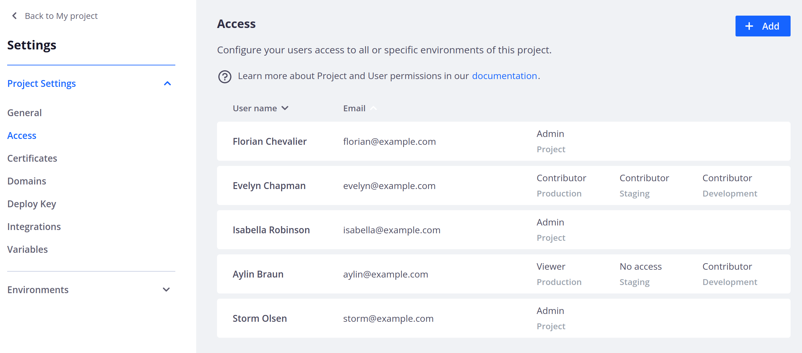
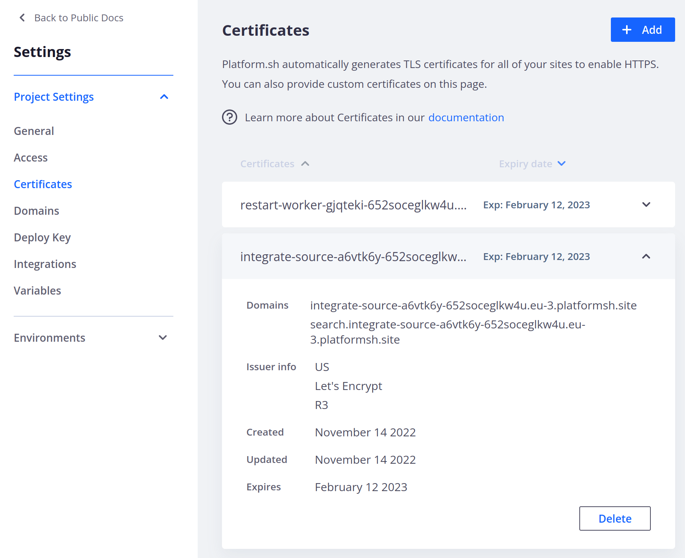
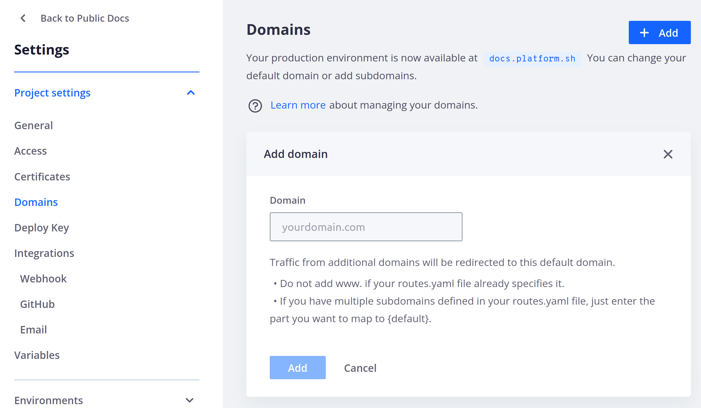
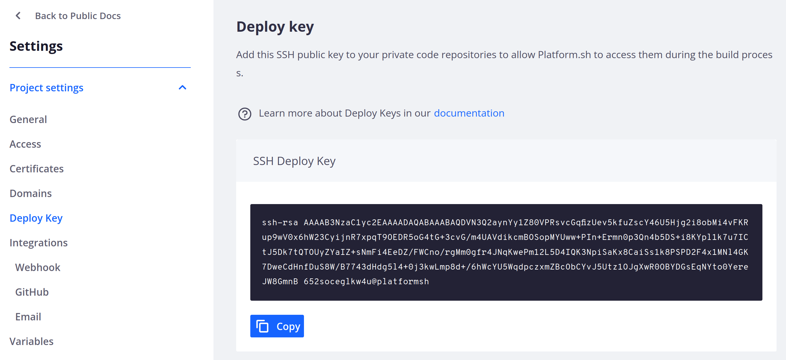
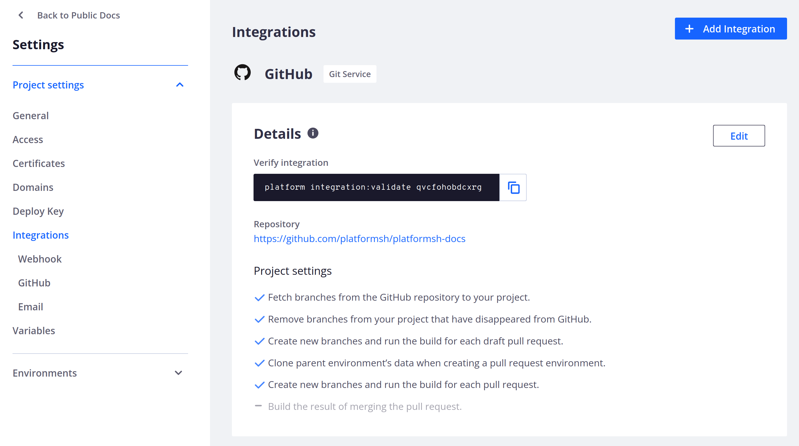
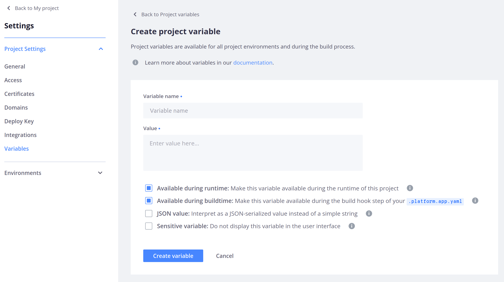

**Last updated 14th November 2023**

## Objective  

Each project has settings that apply to everything within that project, including all its environments.
You can only see and update settings for projects where you are a [Project Admin](../administration-users).
To access the settings, click  **Settings** from the main project page.

The settings are divided into several sections.

## General

The **General** section shows you the project's region and allows you to update the project name and [timezone](../../projects/projects-change-project-timezone).

## Access

The **Access** section allows you to [manage user access to the project](../administration-users).

## Certificates

The **Certificates** section shows a list of your project's TLS certificates.
To see details about a certificate or delete one, click **Edit **.
See how to [add custom certificates](../../domains/domains-steps/tls).

## Domains

The **Domains** section allows you to manage the domains where your project is accessible.
See how to [set up your domain](../../domains/domains-steps).

## Deploy Key

The **Deploy Key** section shows you the public SSH key you can add to your private repositories.
Adding it lets Web PaaS access the repositories during the build process.
This is useful if you want to reuse some code components across multiple projects and manage those components as dependencies of your project.

## Integrations

The **Integrations** section allows you to manage all of your [integrations](../../integrations).

## Variables

The **Variables** section allows you to manage all project-wide [variables](../../development/development-variables).

