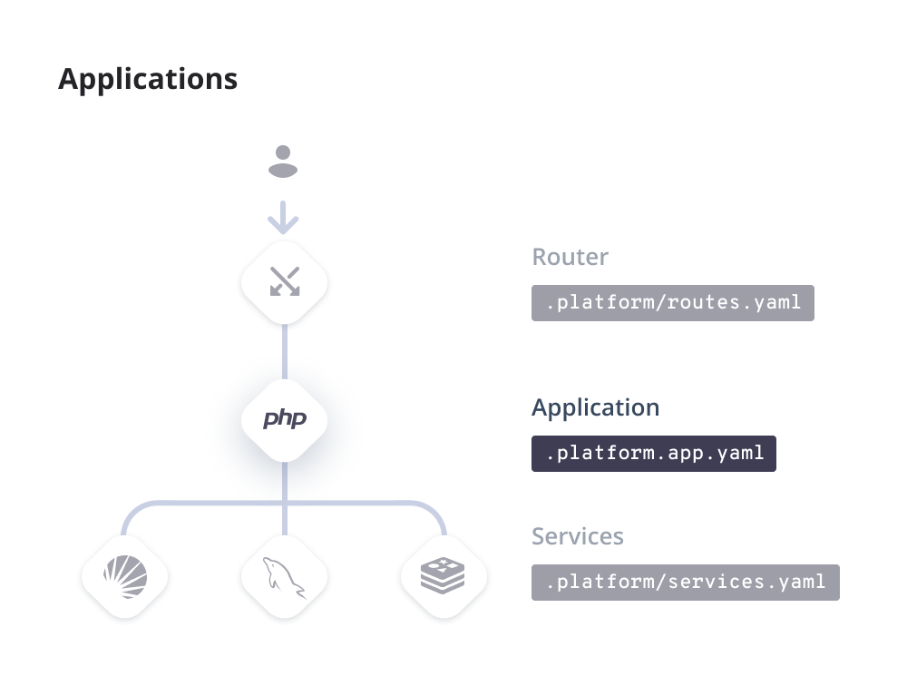

**Last updated 14th November 2023**


## Objective  

{}

{}

{}

Within a single project, you can have one or more apps and each app can have multiple instances.
Instances are where the same code can be run with different configurations,
such as one for external communication and one for background processes.
All of the apps and instances are configured with the same syntax.
You can find a [complete reference](.././.-app-reference) of all possible settings.

## A minimal application

To create a very basic app, you need a few things:


* A unique `name` not shared by any other app in the project.
* The runtime `type` defining what language it uses.
* A `disk` size for your deployed files.
* A definition of how to handle requests from the outside `web`.


The following example shows such a basic setup for Node.js:

<!-- @todo: code-links break the rendering. Removed for now, to revisit. -->


```yaml {configFile="app"}
# The app's name, which must be unique within the project.
name: 'app'

# The language and version for your app.
type: 'nodejs:{}'

# The size of the app's persistent disk (in MB).
disk: 2048

# The app's configuration when it's exposed to the web.
web:
    locations:
        '/':
            # The public directory relative to the app root.
            root: 'public'
            # Forward resources to the app.
            passthru: true
            # What files to use when serving a directory.
            index: ["index.html"]
            # Allow files even without specified rules.
            allow: true
```


