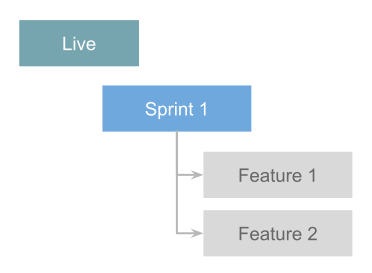
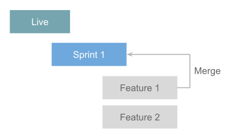
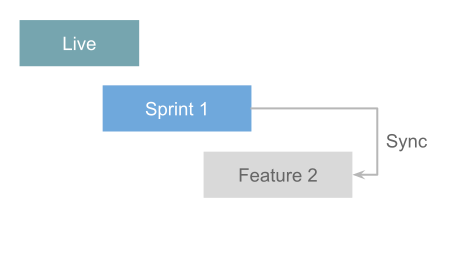
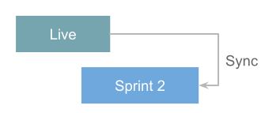

**Last updated 9th November 2023**


## Objective  

A Web PaaS environment contains one instance of an app (../or [group of apps](../or [group of apps](..-create-apps/multi-app))
with all the services needed for it to run.

Each project can include multiple environments,
often divided into [environment types](../administration/users.md#environment-type-roles).
If you have a live site, you have at least a production environment.
You can think of other environments as copies of your live site
where you can run tests without worrying about damaging anything in production.
Once you have completed your tests,
you can merge your changes so that they're instantly and seamlessly deployed to production.

You can create environments for development, testing, staging, review, and so on.
To organize your environments, you can create [hierarchical relationships](#hierarchy).

## Create environments

You can create new environments in one of two ways:

-   Push a local branch through Git or a [source integration](../integrations/integrations-source).


-   [Branch](/glossary.md#branch) existing environments using the [CLI](../administration/administration-cli)

    or the [Console](../administration/administration-web).

When you branch an environment, you might want to create exact replicas of it.
In this case, each new environment inherits all of the data and services from its parent environment.
This includes databases, network storage, queues, and routing configurations.

You can create Web PaaS environments on demand.
Each environment is tied to a Git branch.
If you use a source integration,
you can even have environments created automatically for your pull requests and branches.

You can also have branches that aren't tied to a running instance of your application.
These are called [inactive environments](#environment-status).

## Default environment

Your default environment comes from your default branch and is a [production environment](../administration/users.md#environment-type-roles).
Your project must have a default environment,
but you can [name it as you want](.././.-default-environment).

If you subscribed to a production plan, this environment is your **live site**.
You might want to give it a [custom domain name](../domains/domains-steps).

## Environment status

Your environments can have one of two statuses:

-   [Active](/glossary.md#active-environment):

    A deployed environment with services and data.

-   [Inactive](/glossary.md#inactive-environment):

    An environment that isn't deployed and has no services or data, only code.

You can see the status of your environments in the [Console](../administration/administration-web) or the [CLI](../administration/administration-cli).

> [!tabs]      

You can [change an environment's status](.././.-deactivate-environment) at any time.

## Organize your environments

### Hierarchy


In Web PaaS, your environments are organized in a hierarchy featuring parent and child environments.

When you [branch](/glossary.md#branch) an environment,
the parent of the new environment is the environment it was created from.
You can [change the environment's parent](.././.-change-parent) after it's been created.

When you push a branch through Git or a [source integration](../integrations/integrations-source),
the parent environment of the new environment is your [default environment](#default-environment).
Alternatively, you can [change the environment's parent](.././.-change-parent) after it's been created.

Each child environment can [sync](/glossary.md#sync) code and/or data down from its parent
and [merge](/glossary.md#merge) code up to its parent.
You can use child environments for development, staging, and testing.

### Workflows

Since you can customize your [environment hierarchy](#hierarchy), you can create your own workflows.
You can decide which structure best fits your needs.

#### Possible approaches

You may want to take one of the following approaches when creating your workflows:

-   **Agile**: A child environment per sprint.

    Each story in the sprint can have its own environment as a child of the sprint environment.

-   **Developer-centric**: One QA environment and a few preview environments

    (*per developer*, *per task*, or similar).

-   **Testing**: An operational test environment, a user test environment, and a few unit test environments.


-   **Hotfix**: One environment for each bug, security issue, or hotfix that needs deployment.


#### Example workflow

Example Agile workflow:

1\.  An admin [branches](/glossary.md#branch) the Live (default) environment to create a Sprint environment.


2\.  The admin gives each developer permission to branch the Sprint environment to create new feature environments.


    

3\.  Feature 1 is developed and work is reviewed by accessing the deployed Feature 1 environment.


4\.  When the review is done, Feature 1 is [merged](/glossary.md#merge) into the Sprint environment.


    

5\.  The remaining features [sync](/glossary.md#sync) with the Sprint environment.

    This ensures their working environment is up-to-date with the latest code.

    

6\.  When the sprint is complete and all features merged into the Sprint environment,

    the admin makes a backup of the live site.

7\.  The admin merges the Sprint environment into the Live environment.


    

8\.  The admin syncs the next sprint's environment with the Live environment

    to repeat and continue the development process.

    

### Naming conventions

You can organize and work with your preview environments in many different ways.
It can help to introduce a convention for how you name and structure your environments.

For each environment, choose a name that represents what the environment is for.
If you use Agile, for example, you can adopt a naming convention similar to the following:

```text
Live
  Sprint1
    Feature1
    Feature2
    Feature3
  Sprint2
    Feature1
    Feature2
```

If you prefer splitting your environments per developer and having a specific environment for each task or ticket,
you can adopt a naming convention similar to the following:

```text
Staging
  Developer1
    Ticket-526
    Ticket-593
  Developer2
    Ticket-395
```

## Paused environments

[Preview environments](/glossary.md#preview-environment) are often used for a limited time and then abandoned.
To prevent unnecessary consumption of resources,
Web PaaS automatically pauses preview environments ([of both development and staging types](/glossary.md#environment-type)) that haven't been redeployed in 14 days.


> [!primary]  
> 
> If you're on a development plan,
> all your environments are preview environments that can be paused automatically.
> This includes your future production environment.
> To prevent your production environment from being paused automatically,
> [upgrade to a non-development plan](https://platform.sh/pricing/).
> 
> 

You can also pause an environment manually at any time.

You can [ask Support](../learn/learn-overview/get-support) to disable the automatic pausing of your environments
if you are in one of the following situations:

- You are using the default environment of your Development plan to build an app/demo

  and sharing the URL with users for feedback
- Business staff testing your development branch don't have permission to resume it

- You are using your staging environment to run integration or penetration tests


<--->

You can also pause an environment manually at any time.

{}

### Pause an environment

To pause an environment, follow these steps:

> [!tabs]      

### Resume a paused environment

Pushing new code or redeploying a paused environment automatically resumes it.
You can also resume it manually at any time.

> [!tabs]      

The environment is redeployed and becomes available for use again.

## Push options

Git provides push options to pass a string to the server (see [the official Git documentation](https://git-scm.com/docs/git-push#Documentation/git-push.txt--oltoptiongt)).

Web PaaS supports some of these push options,
which allows you to push changes to your environment and trigger the following actions at the same time:

| Action                                     | Command                                                                                                                 |
| ------------------------------------------ | ----------------------------------------------------------------------------------------------------------------------- |
| Activate the environment                   | `git push {} -o "environment.status=active"`                                    |
| Set a title for the environment            | `git push {} -o "environment.title=<ENVIRONMENT_TITLE>"`       |
| Set the parent environment                 | `git push {} -o "environment.parent=<PARENT_ENVIRONMENT_NAME>"` |         
| Clone the data from the parent environment | `git push {} -o "environment.clone_parent_on_create=True"` |
| Disable the cloning of the data from the parent environment | `git push {} -o "environment.clone_parent_on_create=False"` |

If your remote location isn't named `{}`,
make sure you adjust the commands accordingly.

> [!primary]  
> 
> You can't use push options if you have a [source integration](../integrations/integrations-source) set up.
> 
> 

The following example shows how, through a single `push`,
you can activate your environment, set a title for it,
set a parent environment for it, and clone the data from its parent into it.

```bash {location="Terminal"}
git push {} -o "environment.status=active" -o "environment.title=my-environment-title" -o "environment.parent=my-parent-environment" -o "environment.clone_parent_on_create=True"
```
