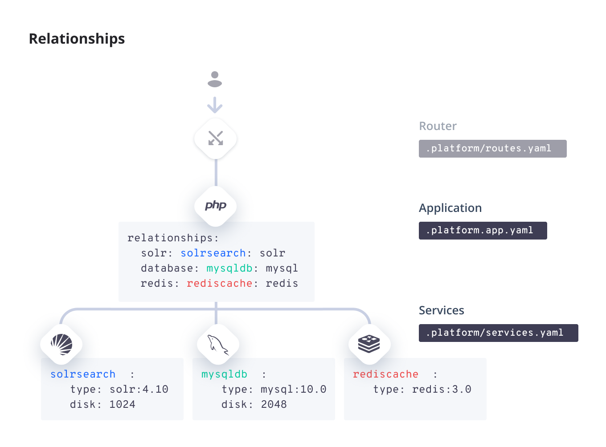

**Last updated 4th November 2023**


## Objective  

Web PaaS includes many services, so you don't have to subscribe to external cache or search engine services.
Because the services are included in your project, you can manage them through Git
and they're backed up together with the rest of your project.


<!-- API Version 1 -->
Your project defines the services configuration in a file named ``.
<--->
<!-- API Version 2 -->
Your project defines the services configuration from a top-level key called `services`, which is placed in a unified configuration file like ``.
{}

If you don't need any services (such as for a static website), you don't need to include this configuration. Read on to see how to add services.

{}

{}

## Add a service

Adding a service is a two-step process.

### 1. Configure the service

All service configuration happens in the `` file in your Git repository.

Configure your service in the following pattern:

```yaml {configFile="services"}
{}
    type: :
    # Other options...
{}
```

An example service configuration for two databases might look like this:


<!-- Version 1 -->

```yaml {configFile="services"}

    type: mariadb:{}
    disk: 2048


    type: postgresql:{}
    disk: 1024

```

<--->
<!-- Version 2 -->

```yaml {configFile="services"}

    type: mariadb:{}


    type: postgresql:{}

```




<!-- API Version 1 -->
This YAML file is a dictionary defining all of the services you want to use.
The top-level key is a custom service name (; in the example, `database1` and `database2`), which you use to identify the service in step 2.
<--->
<!-- API Version 2 -->
This YAML file contains a dictionary defining all of the services you want to use.
The top-level key `services` defines an object of all of the services to be provisioned for the project. 
Below that, come custom service names (; in the example, `database1` and `database2`), which you use to identify services in step 2.
{}
You can give it any name you want with lowercase alphanumeric characters, hyphens, and underscores.

> [!primary]  
> 
> Changing the service name is interpreted as creating an entirely new service.
> This **removes all data in that service**.
> Always back up your data before changing existing services in your `` file.
> 
> 

#### Service options

The following table presents the keys you can define for each service:


<!-- Version 1 -->

| Name            | Type       | Required          | Description |
| --------------- | ---------- | ----------------- | ----------- |
| `type`          | `string`   | Yes               | One of the [available services](#available-services) in the format `type:version`. |
| `disk`          | `integer`  | For some services | The size in [MB](../glossary#mb) of the [persistent disk](#disk) allocated to the service. Can't be set for memory-resident-only services such as `memcache` and `redis`. Limited by your plan settings. |
| `size`          | `string`   |                   | How many CPU and memory [resources to allocate](#size) to the service. Possible values are `AUTO`, `S`, `M`, `L`, `XL`, `2XL`, and `4XL`. Limited by your plan settings.<BR><BR>When `AUTO` applies, available resources are automatically balanced out based on the number of containers on your plan, so that no container is oversized compared to the others. To view the actual sizes of your containers, check the **Environment Configuration** section in your deployment [activity logs](../increase-observability/logs/access-logs.md#activity-logs). |
| `configuration` | dictionary | For some services | Some services have additional specific configuration options that can be defined here, such as specific endpoints. See the given service page for more details. |
| `relationships` | dictionary | For some services | Some services require a relationship to your app. The content of the dictionary has the same type as the `relationships` dictionary for [app configuration](../create-apps/app-reference.md#relationships). The `endpoint_name` for apps is always `http`. |

<--->
<!-- Version 2 -->

| Name            | Type       | Required          | Description |
| --------------- | ---------- | ----------------- | ----------- |
| `type`          | `string`   | Yes               | One of the [available services](#available-services) in the format `type:version`. |
| `configuration` | dictionary | For some services | Some services have additional specific configuration options that can be defined here, such as specific endpoints. See the given service page for more details. |
| `relationships` | dictionary | For some services | Some services require a relationship to your app. The content of the dictionary has the same type as the `relationships` dictionary for [app configuration](../create-apps/app-reference.md#relationships). The `endpoint_name` for apps is always `http`. |

{}


<!-- Version 1 -->

##### Disk

{}

{}

##### Size

Resources are distributed across all containers in a project from the total available from your [plan size](../administration/pricing/_index.md).

By default, Web PaaS allocates CPU and memory resources to each container automatically.
Some services are optimized for high CPU load, some for high memory load.
If your plan is sufficiently large for bigger containers, you can increase the size of your service container.

Note that service containers in preview environments are always set to size `S`.

<--->
<!-- Version 2 -->

##### Resources (CPU, RAM, disk)

Web PaaS allows you to configure resources (CPU, RAM, and disk) per environment for each of your services.
For more information, see how to [manage resources](../manage-resources).

{}

{}

{}

### 2. Connect the service

Once you have configured a service, you need to create a relationship to connect it to an app.
This is done in your [app configuration for relationships](../create-apps/app-reference.md#relationships).

The relationship follows this pattern:

```yaml {configFile="app"}
{}

# Other options...

# Relationships enable an app container's access to a service.
relationships:
    : ":"
{}
{}
    type: :
    # Other options...
{}
```

An example relationship to connect to the databases given in the [example in step 1](#1-configure-the-service):


<!-- Version 1 -->

```yaml {configFile="app"}


# Other options...

# Relationships enable an app container's to a service.
relationships:
    mysql_database: "database1:mysql"
    postgresql_database: "database2:postgresql"


    type: mariadb:{}
    disk: 2048


    type: postgresql:{}
    disk: 1024

```

<--->
<!-- Version 2 -->

```yaml {configFile="app"}


# Other options...

# Relationships enable an app container's to a service.
relationships:
    mysql_database: "database1:mysql"
    postgresql_database: "database2:postgresql"


    type: mariadb:{}


    type: postgresql:{}

```

{}

As with the service name, you can give the relationship any name you want
with lowercase alphanumeric characters, hyphens, and underscores.
It helps if the service name and relationship name are different, but it isn't required.

Each service offers one or more endpoints for connections, depending on the service.
An endpoint is a named set of credentials to give access to other apps and services in your project.
If you don't specify one in the [service configuration](#service-options), a default endpoint is created.
The default endpoint varies by service, generally being its type (such as `mysql` or `solr`).

## Available services

The following table presents the available service types and their versions.
Add them to the `type` key of the [service configuration](#1-configure-the-service) in the format `type:version`.

<!-- To update the versions in this table, use docs/data/registry.json -->
{}

### Service versions

These services generally follow [semantic versioning conventions](https://semver.org/).
You can select the major version, but the latest compatible minor is applied automatically and can’t be overridden.
Patch versions are applied periodically for bug fixes and the like.
When you deploy your app, you always get the latest available patches.

## Service timezones

All services have their system timezone set to UTC by default.
For some services, you can change the timezone for the running service
(this doesn't affect the container itself and so logs are still in UTC).

* [MySQL](./mysql/_index.md#service-timezone)
* [PostgreSQL](./postgresql.md#service-timezone)

## Connect to a service

For security reasons, you can't access services directly through HTTP.
You can connect through your app or by opening an SSH tunnel to access the service directly.

> [!tabs]      
