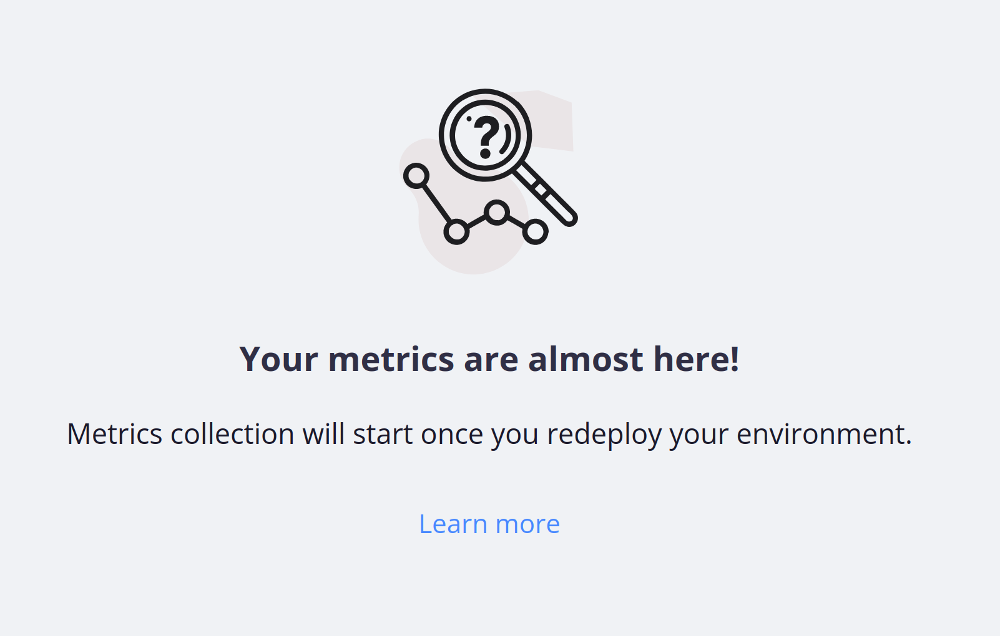
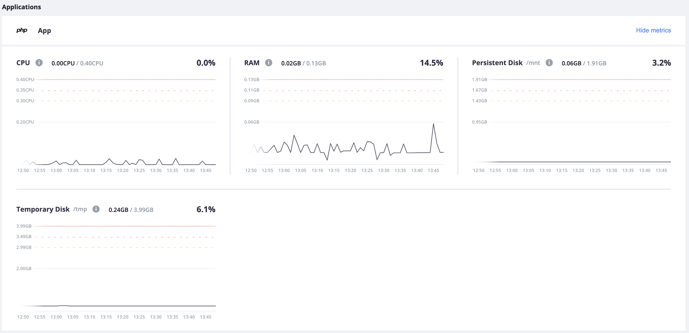
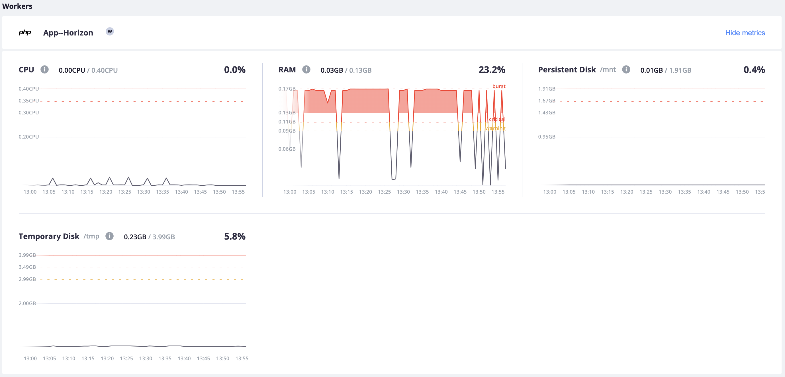

**Last updated 4th November 2023**

## Objective  

Grid environments consist of:

* App containers: one or more [app containers](../../create-apps/_index.md)
* Service containers: zero or more [service containers](../../add-services/_index.md)
* Worker containers: zero or more [worker instances](../../create-apps/app-reference.md#workers).

Infrastructure metrics report CPU, RAM, and disk space for app and worker containers
and CPU and disk space for service containers.
These metrics are available for all of your Grid environments.

You can see summaries of the metrics for each container separately in the Console under **Services** for a given environment.
The full details are available under **Metrics**.

App containers are shown first, with the app name and an image corresponding to the app type.
Service containers follow next with the same pattern and worker containers are shown last.

You can collapse the graphs by clicking **Hide metrics**.
The graphs switch to an overview of the average resource utilization for the selected container.

## Start metrics collection

To start collecting metrics on Grid environments, you need to redeploy the environment.
If a redeploy is required for the specific environment, you see a note in the Console:

## Example of how to read metrics

This example should give you an idea of how the metrics appear.
Grid environment metrics show resource usage for each app, service, and worker container.

Note that resources are spread across all containers within the project.
So the resources you see for a given container don't equal the total resources for the project.

This reference project has a single app, two services (MySQL and Redis), and two workers.
The plan size for this project is [Medium](https://platform.sh/pricing/).
The appropriate resources have been [allocated automatically](../../create-apps/app-reference.md#sizes) for each container
based on the number and type of containers for this plan size.
The graphs show the current average usage in relation to the allocated resources.

Once you've read the metrics, see [recommendations for action](./_index.md#grid-environments).

### App container

Metrics graphs for the app container show CPU, RAM, and disk allocation and usage.
The persistent disk has been configured in the [app configuration](../../create-apps/app-reference.md#top-level-properties)
at 1.91&nbsp;GB, while the temporary disk is 3.99&nbsp;GB by default.

### Service containers

Unlike [app containers](#app-container), metrics graphs service containers don't show RAM allocation and usage.
So you don't see all of your project's allocated RAM in the graphs.

#### MySQL

Metrics graphs for the MySQL service container show CPU and disk allocation and usage.
The persistent disk has been configured in the [services configuration](../../add-services/_index.md)
as 0.95&nbsp;GB,
while the temporary disk is 3.99&nbsp;GB by default.

#### Redis

Metrics graphs for the Redis service container show CPU and disk allocation and usage.
No persistent disk has been configured for Redis,
while the temporary disk is 3.99&nbsp;GB by default.

### Worker containers

Metrics graphs for the App-Horizon worker container show CPU, RAM, and disk allocation and usage.
The persistent disk has been configured in the [app configuration](../../create-apps/app-reference.md#top-level-properties)
at 1.91&nbsp;GB, while the temporary disk is 3.99&nbsp;GB by default.

Metrics graphs for the App-Schedule worker container show CPU, RAM, and disk allocation and usage.
The persistent disk has been configured in the [app configuration](../../create-apps/app-reference.md#top-level-properties)
at 1.91&nbsp;GB, while the temporary disk is 3.99&nbsp;GB by default.

