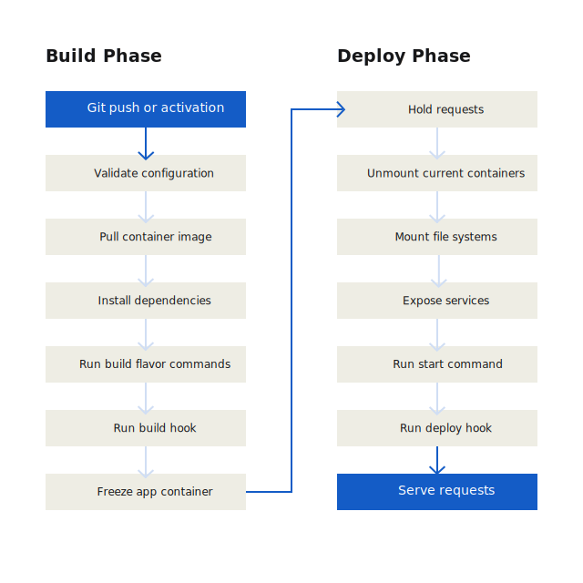

**Last updated 6th November 2023**

## Objective  

**Last updated 6th November 2023**

## Objective  

Each time you push a change to your app through Git or activate an [environment](../../../environments),
your app goes through a process to be built and deployed.
If your app is redeployed with no changes to its codebase, the output of the previous build and deploy process is reused.

The build process looks through the configuration files in your repository and assembles the necessary containers.
The deploy process makes those containers live, replacing any previous versions, with minimal interruption in service.

Hooks are points in the build and deploy process where you can inject a custom script.

## The build

The outcome of the build process is designed to be repeatable and reusable.
Each app in a project is built separately.

Container configuration depends exclusively on your configuration files.
So each container is tied to a specific Git commit.
If there are no new changes for a given container, the existing container can be reused.
This saves you the time the build step would take.

This means the build is independent of the given environment and preview environments are perfect copies of production.
If you use environment variables to set up different build configuration options for different environments,
your build step isn't reused and your preview environments may differ from production.

You can't connect to services (like databases) during the build step.
Once the app has gone through all of the build steps, it can connect to services in the deploy process.

### Build steps

<!-- Web PaaS -->
1\. **Validate configuration**:

   The configuration is checked by validating the `` directory and scanning the repository for any app configurations to validate individually.
<--->
<!-- Upsun -->
1\. **Validate configuration**:

   The configuration is checked by validating the `` directory and scanning the repository for any app configuration to validate.
{}
2\. **Pull container images**:

   Any container images that have been built before and that don't have any changes are pulled to be reused.
3\. **Install dependencies**:

   If you have specified additional global dependencies, they're downloaded during this step.
   This is useful for commands you may need in the build hook.
4\. **Run build flavor commands**:

   For some languages (NodeJS, PHP), a series of standard commands are run based on the build flavor.
   You can change the flavor or skip the commands by specifying it in your `` file.
5\. **Run build hook**:

   The `build` hook comprises one or more shell commands that you write to finish creating your production code base.
   It could be compiling Sass files, running a bundler, rearranging files on disk, or compiling.
   The committed build hook runs in the build container.
   During this time, commands have write access to the file system, but there aren't connections to other containers (services and other apps).
   Note that you can [cancel deployments stuck on the build hook](../../environments-cancel-activity).
6\. **Freeze app container**:

   The file system is frozen and produces a read-only container image, which is the final build artifact.

## The deploy

The deploy process connects each container from the build process and any services.
The connections are defined in your app and services configuration.

So unlike the build process, you can now access other containers,
but the file system is read-only.

### Deploy steps

1\. **Hold requests**:

   Incoming requests are held to prevent service interruption.
1\. **Unmount current containers**:

   Any previous containers are disconnected from their file system mounts.
1\. **Mount file systems**:

   The file system is connected to the new containers.
   New branches have file systems cloned from their parent.
1\. **Expose services**:

   Networking connections are opened between any containers specified in your app and services configurations.
1\. **Run start commands**:

   The commands necessary to start your app are run.
1\. **Run deploy hook**:

   The `deploy` hook is any number of shell commands you can run to finish your deployment.
   This can include clearing caches, running database migrations, and setting configuration that requires relationship information.
1\. **Serve requests**:

  Incoming requests to your newly deployed application are allowed.

After the deploy process is over, any commands in your `post_deploy` hook are run.

## Deployment philosophy

Web PaaS values consistency over availability, acknowledging that it's nearly impossible to have both.
During a deployment, the [deploy hook](../../create-apps-hooks/hooks-comparison#deploy-hook) may make database changes
that are incompatible with the previous code version.
Having both old and new code running in parallel on different servers could therefore result in data loss.

Web PaaS believes that a minute of planned downtime for authenticated users is preferable to a risk of race conditions
resulting in data corruption, especially with a CDN continuing to serve anonymous traffic uninterrupted.

That brief downtime applies only to the environment changes are being pushed to.
Deployments to a staging or development branch have no impact on the production environment and cause no downtime.

## What's next

* See how to [configure your app](../../../create-apps) for the entire process.
* Learn more about [using build and deploy hooks](../../create-apps-hooks).
